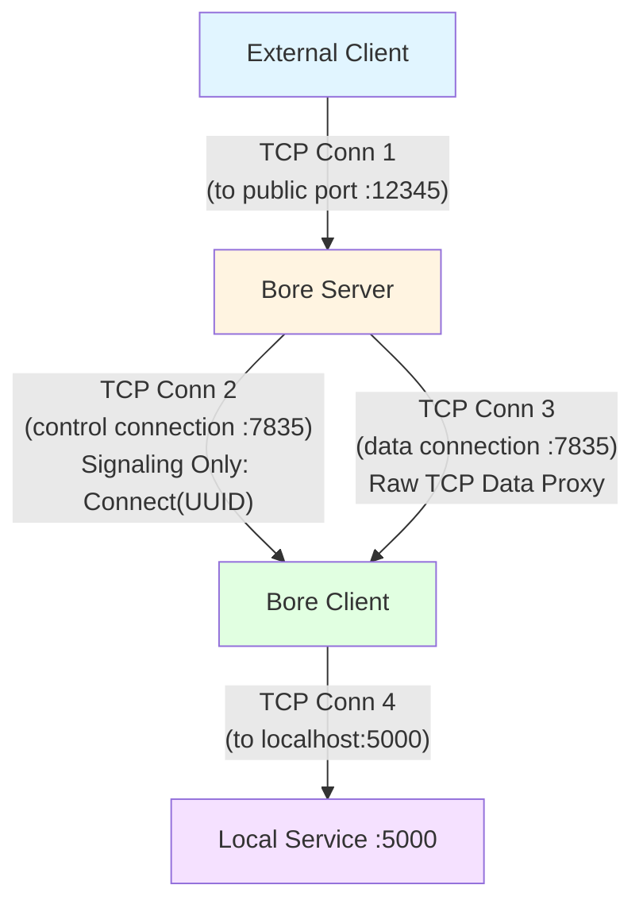
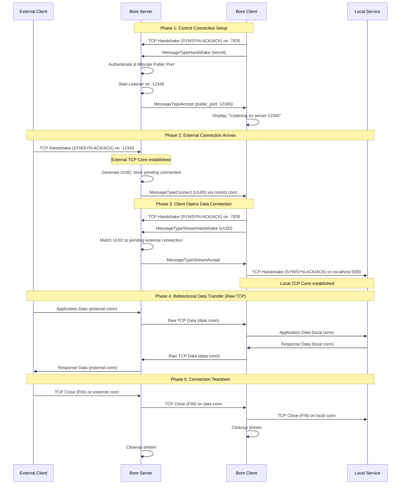
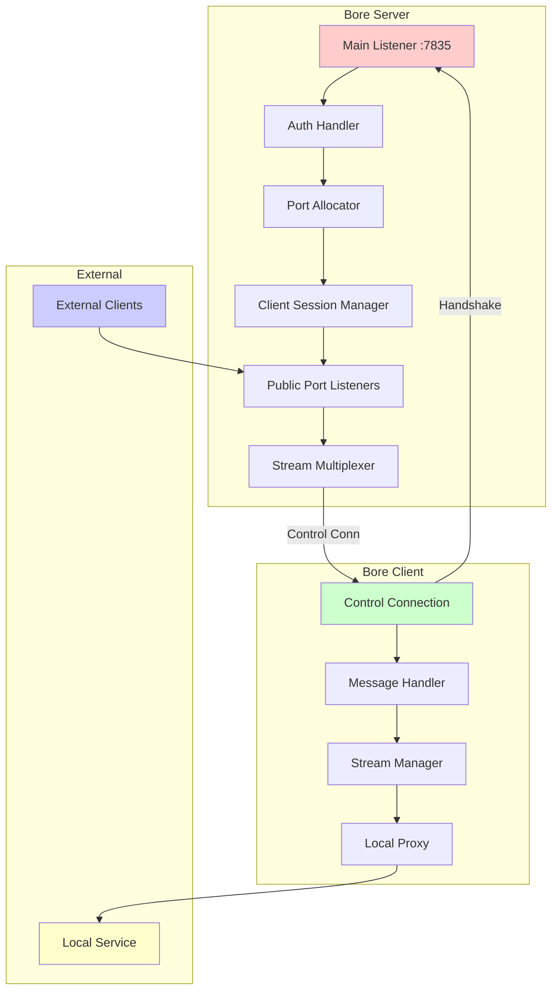

# Design Document

## Overview

The `gobore` system implements a TCP port tunneling solution using a client-server architecture. The client establishes a persistent control connection to the server for signaling, which then allocates a public port. When external traffic arrives at this public port, the server signals the client with a unique connection identifier (UUID). The client then opens a new dedicated TCP connection to the server for that specific stream, allowing direct TCP proxying without multiplexing overhead.

The design uses a simple protocol over TCP with two types of connections:
1. **Control Connection**: Persistent connection for signaling (handshake, authentication, port allocation, connection notifications)
2. **Data Connections**: One dedicated TCP connection per external client connection, established on-demand for raw data proxying

## Architecture

### High-Level Architecture

The system uses FOUR separate TCP connections per external client:

1. **External Client ↔ Bore Server** (public port, e.g., :12345)
2. **Bore Server ↔ Bore Client** (control connection, e.g., :7835) - persistent, for signaling only
3. **Bore Server ↔ Bore Client** (data connection, e.g., :7835) - one per external connection, for data proxying
4. **Bore Client ↔ Local Service** (e.g., localhost:5000)



**Key Point**: The control connection (Conn 2) is persistent and used only for signaling. When an external client connects, the server signals the client with a UUID, and the client opens a new data connection (Conn 3) specifically for that stream. This allows:
- Simple raw TCP proxying without multiplexing complexity
- Independent flow control per stream (no head-of-line blocking)
- Better isolation between concurrent connections
- Easier debugging (each stream is a separate TCP connection)

### System Flow Diagram



### Component Diagram



## Components and Interfaces

### 1. Protocol Layer

The protocol uses length-prefixed messages over TCP. Each message has:
- **Message Type** (1 byte): Identifies the message purpose
- **Stream ID** (4 bytes): Identifies which proxied connection this message belongs to (0 for control messages)
- **Length** (4 bytes): Payload length
- **Payload** (variable): Message data

#### Message Types

```go
const (
    // Control Connection Messages
    MessageTypeHandshake       = 0x01  // Client → Server: Initial handshake with auth
    MessageTypeAccept          = 0x02  // Server → Client: Handshake accepted, includes public port
    MessageTypeReject          = 0x03  // Server → Client: Handshake rejected
    MessageTypeConnect         = 0x04  // Server → Client: New external connection (includes UUID)
    
    // Data Connection Messages
    MessageTypeStreamHandshake = 0x05  // Client → Server: Identify which stream (includes UUID)
    MessageTypeStreamAccept    = 0x06  // Server → Client: Stream matched, ready for data
    MessageTypeStreamReject    = 0x07  // Server → Client: UUID not found or expired
)
```

#### Handshake Message Payload

```go
type HandshakePayload struct {
    Version    uint8   // Protocol version (currently 1)
    Secret     string  // Authentication secret (empty if no auth)
}
```

#### Accept Message Payload

```go
type AcceptPayload struct {
    PublicPort uint16  // Allocated public port on server
    ServerHost string  // Server hostname/IP for display
}
```

#### Connect Message Payload

```go
type ConnectPayload struct {
    UUID string  // Unique identifier for this external connection (36 bytes, standard UUID format)
}
```

#### Stream Handshake Payload

```go
type StreamHandshakePayload struct {
    UUID string  // Matches the UUID from MessageTypeConnect (36 bytes)
}
```

### 2. Client Component

#### Main Client Structure

```go
type Client struct {
    serverAddr  string                      // Server address (host:port)
    localPort   int                         // Local port to expose
    localHost   string                      // Local host (default: localhost)
    secret      string                      // Authentication secret
    controlConn net.Conn                    // Control connection to server (persistent)
    streams     map[string]*ClientStream    // Active proxied connections (UUID -> ClientStream)
    streamMu    sync.RWMutex                // Protects streams map
}
```

#### Client Workflow

1. **Connect**: Establish TCP connection to server (control connection)
2. **Handshake**: Send handshake message with secret
3. **Wait for Accept**: Receive accept message with public port
4. **Display URL**: Show user the public URL
5. **Message Loop**: Continuously read messages from control connection
   - On `MessageTypeConnect(UUID)`: Spawn goroutine to handle new stream
     - Open new TCP connection to server (data connection)
     - Send `MessageTypeStreamHandshake(UUID)`
     - Wait for `MessageTypeStreamAccept`
     - Dial local service
     - Start bidirectional raw TCP proxy (io.Copy)
6. **Shutdown**: On Ctrl+C, close all streams and control connection

### 3. Server Component

#### Main Server Structure

```go
type Server struct {
    listenPort     int                          // Port to listen for client connections
    secret         string                       // Required authentication secret
    clients        map[string]*ClientSession    // Active client sessions
    clientsMu      sync.RWMutex                 // Protects clients map
    portAllocator  *PortAllocator               // Manages public port allocation
    pendingStreams map[string]*PendingStream    // UUID -> waiting external connection
    pendingMu      sync.RWMutex                 // Protects pendingStreams map
}

type ClientSession struct {
    id          string                      // Unique client ID
    controlConn net.Conn                    // Control connection (persistent, for signaling)
    publicPort  int                         // Allocated public port
    listener    net.Listener                // Listener for public port
    streams     map[string]*ServerStream    // Active proxied connections (UUID -> ServerStream)
    streamsMu   sync.RWMutex                // Protects streams map
}

type PendingStream struct {
    externalConn net.Conn      // The waiting external connection
    createdAt    time.Time      // When this was created
    timeout      *time.Timer    // Cleanup timer (30 seconds)
}
```

#### Server Workflow

1. **Listen**: Start listening on configured port for both control and data connections
2. **Accept Connection**: When connection arrives, determine type:
   - First message is `MessageTypeHandshake` → Control connection
   - First message is `MessageTypeStreamHandshake` → Data connection
3. **Control Connection Flow**:
   - Authenticate: Read handshake message and verify secret
   - Allocate Port: Find available port and create listener
   - Send Accept: Send accept message with public port
   - Start Public Listener: Accept connections on public port
     - On new external connection: Generate UUID, store in pendingStreams
     - Send `MessageTypeConnect(UUID)` to client via control connection
     - Set 30-second timeout for client to open data connection
   - Keep control connection alive for signaling
4. **Data Connection Flow**:
   - Read `MessageTypeStreamHandshake(UUID)`
   - Look up UUID in pendingStreams
   - If found: Send `MessageTypeStreamAccept`, start bidirectional proxy
   - If not found/expired: Send `MessageTypeStreamReject`, close connection
   - Proxy: Use io.Copy for raw TCP forwarding (no framing needed)
5. **Cleanup**: On client disconnect, close all streams and release port

### 4. Stream Management

Each proxied connection is represented as a stream with a unique UUID. We use separate Stream structs for server and client since they manage different connection types:

#### Server-Side Stream

```go
type ServerStream struct {
    uuid         string
    dataConn     net.Conn      // Data connection to client
    externalConn net.Conn      // External client connection (from public port)
    closeCh      chan struct{} // Signal for cleanup
    createdAt    time.Time     // For monitoring/debugging
}
```

**Server Stream Lifecycle:**
1. External client connects to public port → Generate UUID
2. Store external connection in `pendingStreams` with 30-second timeout
3. Send `MessageTypeConnect(UUID)` to client via control connection
4. Client opens data connection with `MessageTypeStreamHandshake(UUID)`
5. Match UUID, create `ServerStream`, start bidirectional proxy
6. Proxy: `io.Copy(dataConn, externalConn)` and `io.Copy(externalConn, dataConn)`
7. Cleanup when either connection closes

#### Client-Side Stream

```go
type ClientStream struct {
    uuid      string
    dataConn  net.Conn      // Data connection to server
    localConn net.Conn      // Connection to local service
    closeCh   chan struct{} // Signal for cleanup
    createdAt time.Time     // For monitoring/debugging
}
```

**Client Stream Lifecycle:**
1. Receive `MessageTypeConnect(UUID)` on control connection
2. Spawn goroutine to handle new stream
3. Open data connection to server
4. Send `MessageTypeStreamHandshake(UUID)`
5. Wait for `MessageTypeStreamAccept`
6. Dial local service (localhost:localPort)
7. Create `ClientStream`, start bidirectional proxy
8. Proxy: `io.Copy(dataConn, localConn)` and `io.Copy(localConn, dataConn)`
9. Cleanup when either connection closes

#### Benefits of Separate Structs

- **Clarity**: Each struct only contains fields relevant to its side
- **Type Safety**: Cannot accidentally use wrong connection type
- **Maintainability**: Changes to one side don't affect the other
- **Documentation**: Field names clearly indicate purpose (externalConn vs localConn)

Streams are cleaned up when any connection closes (TCP FIN/RST propagates naturally through io.Copy).

### 5. Port Allocator

```go
type PortAllocator struct {
    minPort     int
    maxPort     int
    allocated   map[int]bool
    mu          sync.Mutex
}

func (pa *PortAllocator) Allocate() (int, error)
func (pa *PortAllocator) Release(port int)
```

The allocator finds available ports in a configured range (default: 10000-60000) and tracks allocations.

## Data Models

### Message Frame

**Control and Data Connection Messages (with framing):**
```
+--------+--------+----------+
| Type   | Length | Payload  |
| 1 byte | 4 bytes| Variable |
+--------+--------+----------+
```

**After Stream Handshake (raw TCP):**
```
No framing - just raw TCP bytes
```

Once a data connection completes the stream handshake (MessageTypeStreamHandshake → MessageTypeStreamAccept), all subsequent data is raw TCP with no protocol framing. This simplifies the implementation and improves performance.

**Note:** The message frame does not include a stream ID field since the connection-per-stream design uses dedicated TCP connections for each stream. Stream identification is handled via UUIDs in the payload of control messages.

### Connection State Machine

```
Client States:
  Disconnected → Connecting → Authenticating → Connected → Tunneling → Disconnected

Server States (per client):
  Waiting → Authenticating → Allocated → Proxying → Cleanup
```

## Error Handling

### Client Error Scenarios

1. **Connection Refused**: Server not reachable
   - Action: Display error, exit with code 1

2. **Authentication Failed**: Wrong secret
   - Action: Display "Authentication failed", exit with code 1

3. **Local Port Not Listening**: Service not running
   - Action: Display warning, continue (connections will fail individually)

4. **Network Errors During Tunneling**: Connection drops
   - Action: Attempt reconnect with exponential backoff (1s, 2s, 4s, max 30s)

5. **Protocol Errors**: Malformed messages
   - Action: Log error, close connection, exit

### Server Error Scenarios

1. **Port Already in Use**: Cannot bind to listen port
   - Action: Display error, exit with code 1

2. **Port Allocation Failed**: No available ports
   - Action: Send reject message to client, close connection

3. **Client Protocol Violation**: Invalid messages
   - Action: Log warning, close client connection, cleanup resources

4. **Resource Exhaustion**: Too many connections
   - Action: Reject new clients with appropriate message

## Testing Strategy

### Unit Tests

1. **Protocol Encoding/Decoding**
   - Test message serialization and deserialization
   - Test handling of malformed messages
   - Test boundary conditions (max payload size, etc.)

2. **Port Allocator**
   - Test allocation and release
   - Test exhaustion scenarios
   - Test concurrent allocation

3. **Stream Management**
   - Test stream creation and cleanup
   - Test concurrent stream operations
   - Test stream ID generation

### Integration Tests

1. **Client-Server Handshake**
   - Test successful authentication
   - Test failed authentication
   - Test protocol version mismatch

2. **End-to-End Tunneling**
   - Start local HTTP server
   - Start bore server
   - Start bore client
   - Make HTTP request through tunnel
   - Verify response matches direct connection

3. **Multiple Concurrent Connections**
   - Create multiple external connections
   - Verify data isolation between streams
   - Verify all connections work simultaneously

4. **Connection Lifecycle**
   - Test graceful shutdown
   - Test abrupt disconnection
   - Test reconnection logic

5. **Error Scenarios**
   - Test behavior when local service is down
   - Test behavior when server disconnects
   - Test behavior with network delays

### Manual Testing

1. **Real-World Usage**
   - Expose local web server
   - Test with various protocols (HTTP, WebSocket, SSH)
   - Test with large file transfers
   - Test with long-lived connections

2. **Performance Testing**
   - Measure latency overhead
   - Measure throughput
   - Test with many concurrent connections

## Implementation Notes

### Concurrency Considerations

- Use goroutines for each proxied connection to handle bidirectional forwarding
- Use channels for coordinating shutdown
- Use mutexes to protect shared maps (streams, clients)
- Ensure proper cleanup to avoid goroutine leaks

### Buffer Management

- Use buffered channels (size: 1024) for write operations to prevent blocking
- Use io.Copy with default buffer size for data forwarding
- Implement backpressure by blocking writes when buffers are full

### Logging

- Use structured logging (e.g., log/slog)
- Log levels: INFO (connection events), DEBUG (verbose data transfer), ERROR (failures)
- Include context: client ID, stream ID, timestamps

### CLI Framework

- Use cobra for command structure
- Commands: `server`, `local`
- Global flags: `--verbose`, `--help`, `--version`
- Command-specific flags as defined in requirements

## Security Considerations

1. **Authentication**: Simple shared secret, transmitted in handshake
   - Note: Not encrypted, suitable for trusted networks or when used with TLS
   - Future enhancement: Add TLS support

2. **Resource Limits**: Prevent DoS
   - Limit maximum connections per client
   - Limit maximum message size
   - Implement connection timeouts

3. **Input Validation**: Validate all inputs
   - Port numbers in valid range
   - Message lengths within limits
   - Stream IDs are valid

## Future Enhancements

1. **TLS Support**: Encrypt control connection
2. **Port Persistence**: Allow clients to request specific public ports
3. **HTTP Subdomain Routing**: Route based on HTTP Host header instead of ports
4. **Metrics**: Expose Prometheus metrics for monitoring
5. **Web Dashboard**: Server UI showing active tunnels

---

## Alternative Approaches Considered

### Multiplexed Single-Connection Approach

During the design phase, we considered an alternative architecture where all data streams are multiplexed over a single persistent TCP connection between the client and server, rather than opening a new connection per stream.

#### Architecture Overview

```
External Client → Server (public port) → [Single Control Connection with Multiplexing] → Client → Local Service
```

**How it works:**
1. Client establishes ONE persistent TCP connection to server
2. When external client connects to public port, server assigns a numeric stream ID
3. Server sends `MessageTypeConnect(streamID)` over the control connection
4. All data flows through the SAME control connection with stream IDs to distinguish traffic
5. Messages: `MessageTypeData(streamID, payload)` for each stream

#### Protocol Differences

```go
const (
    MessageTypeHandshake    = 0x01  // Client → Server: Initial handshake with auth
    MessageTypeAccept       = 0x02  // Server → Client: Handshake accepted, includes public port
    MessageTypeReject       = 0x03  // Server → Client: Handshake rejected
    MessageTypeData         = 0x04  // Bidirectional: Proxied connection data (includes streamID)
    MessageTypeConnect      = 0x05  // Server → Client: New external connection (includes streamID)
    MessageTypeDisconnect   = 0x06  // Bidirectional: Connection closed (includes streamID)
)

// Message frame includes stream ID
type Message struct {
    Type     uint8
    StreamID uint32   // Identifies which stream this message belongs to
    Payload  []byte
}
```

#### Advantages of Multiplexed Approach

1. **Lower Connection Overhead**: Only one TCP connection between client and server
   - Fewer TCP handshakes (no new connection per external client)
   - Lower resource usage (fewer file descriptors)
   - Less memory for connection state

2. **Simpler NAT Traversal**: Only need to maintain one persistent connection
   - Easier to keep alive through firewalls
   - Single connection to monitor for health checks

3. **Better for High-Frequency Short-Lived Connections**: 
   - HTTP requests that complete quickly
   - No TCP handshake overhead per request
   - Connection pooling not needed

4. **Consistent Latency**: First byte latency is predictable
   - No new TCP handshake delay
   - Connection already established

#### Disadvantages of Multiplexed Approach

1. **Head-of-Line Blocking**: 
   - If one stream has slow data or large payload, it can block other streams
   - TCP flow control applies to entire connection, not per stream
   - One slow client affects all clients

2. **More Complex Protocol**:
   - Need stream multiplexing/demultiplexing logic
   - Must implement proper buffering per stream
   - More complex error handling (stream-level vs connection-level)

3. **Single Point of Failure**:
   - If control connection drops, ALL streams die simultaneously
   - Reconnection logic must handle re-establishing all streams

4. **Buffer Management Complexity**:
   - Need per-stream buffers to prevent one stream from starving others
   - Must implement backpressure mechanisms
   - Risk of memory bloat with many concurrent streams

5. **Debugging Difficulty**:
   - Cannot inspect individual streams with standard tools (tcpdump, wireshark)
   - All traffic looks like one connection
   - Harder to identify which stream has issues

#### Performance Comparison

| Aspect | Multiplexed | Connection-Per-Stream (Chosen) |
|--------|-------------|-------------------------------|
| First byte latency | Lower (connection exists) | Higher (new TCP handshake ~1-2 RTT) |
| Throughput per stream | Limited by shared TCP window | Full TCP window per stream |
| Concurrent streams | Limited by buffer management | Limited by file descriptors |
| Memory usage | Lower (shared buffers) | Higher (per-connection buffers) |
| CPU usage | Higher (mux/demux logic) | Lower (kernel handles TCP) |
| Head-of-line blocking | Yes (single TCP queue) | No (independent TCP queues) |
| Isolation | Poor (streams affect each other) | Excellent (independent connections) |

#### Why We Chose Connection-Per-Stream

After careful consideration, we chose the **Connection-Per-Stream** approach for the following reasons:

1. **Simplicity**: Raw TCP proxying is simpler than implementing a multiplexing protocol
   - Less code to write and maintain
   - Fewer edge cases to handle
   - Easier to debug and troubleshoot

2. **Better Isolation**: Each stream is completely independent
   - One slow client doesn't affect others
   - TCP flow control works naturally per stream
   - Easier to implement rate limiting per stream

3. **General Purpose**: Works well for various use cases
   - Long-lived connections (SSH, database)
   - Large file transfers
   - WebSocket connections
   - Any protocol that benefits from independent flow control

4. **Standard Tools Work**: Can use tcpdump, wireshark, netstat to debug individual streams

5. **Acceptable Overhead**: For most use cases, the overhead of additional TCP connections is negligible
   - Modern systems handle thousands of connections easily
   - Connection setup time (1-2 RTT) is acceptable for most applications
   - File descriptor limits are high enough (typically 1024+ per process)

#### When Multiplexed Would Be Better

The multiplexed approach would be preferable in these scenarios:

1. **Very High Connection Rate**: Thousands of short-lived connections per second
   - Example: High-traffic HTTP API with sub-second request duration
   - Connection setup overhead becomes significant

2. **Strict Firewall Environments**: Only one outbound connection allowed
   - Some corporate firewalls limit number of connections
   - NAT traversal is critical

3. **Resource-Constrained Environments**: Limited file descriptors or memory
   - Embedded systems
   - Containers with strict resource limits

4. **Consistent Low Latency Required**: First byte latency must be minimal
   - Real-time applications where TCP handshake delay is unacceptable
   - Gaming, live streaming control channels

For a general-purpose tunneling tool like `gobore`, the Connection-Per-Stream approach provides the best balance of simplicity, performance, and debuggability.
